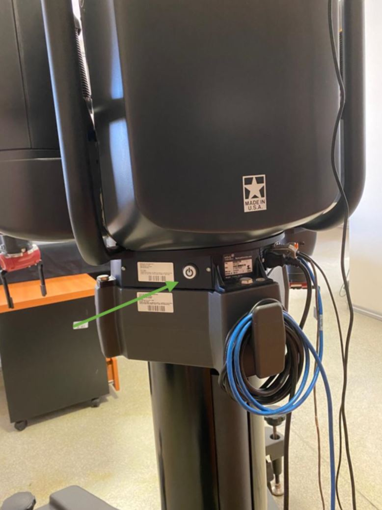
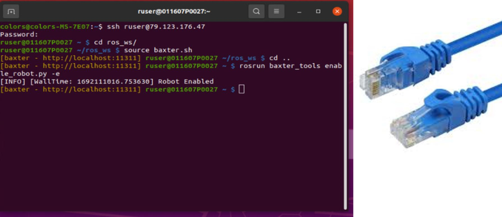
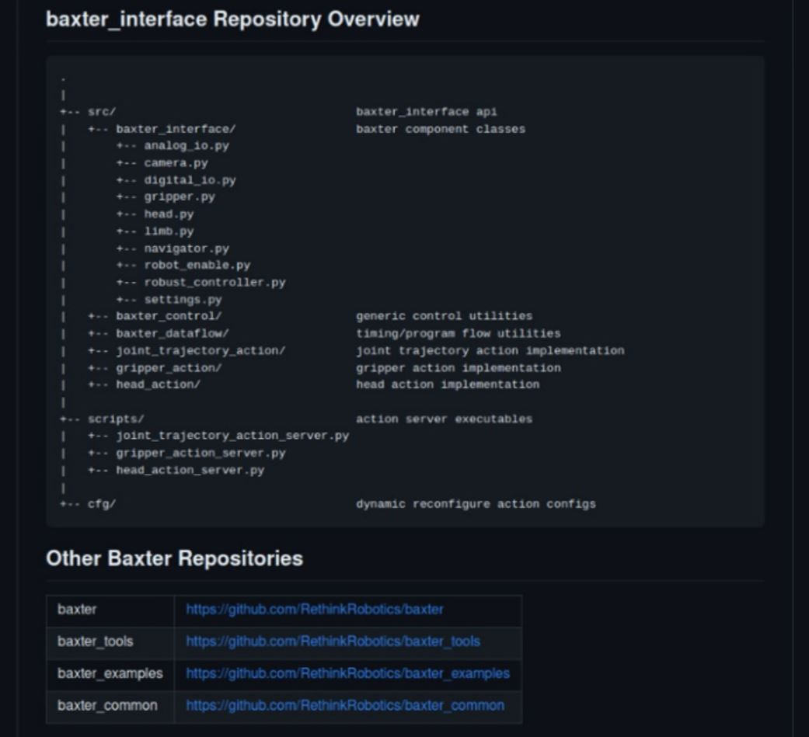
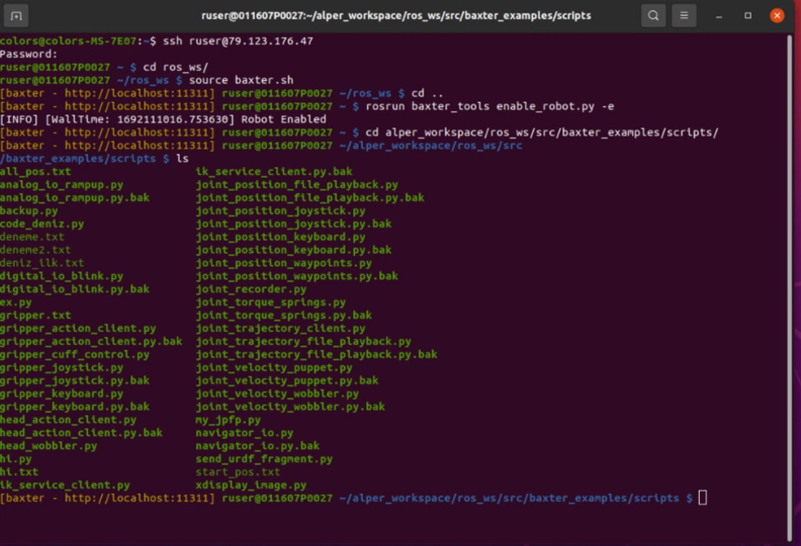
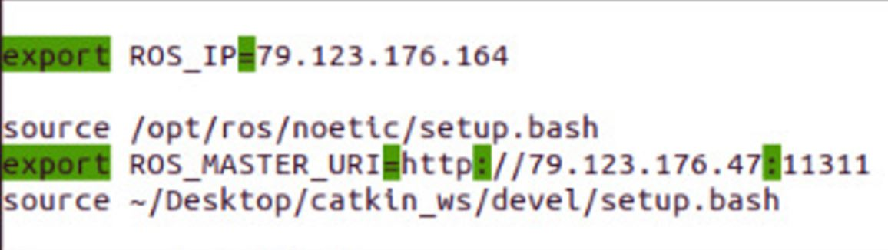
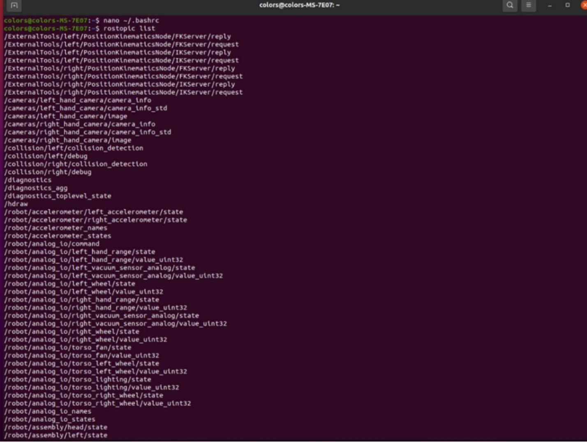
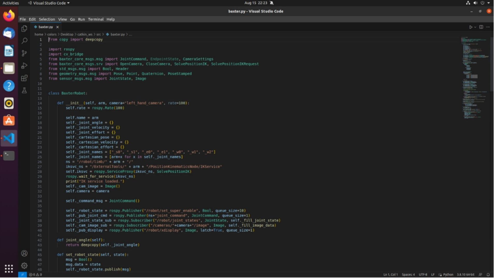
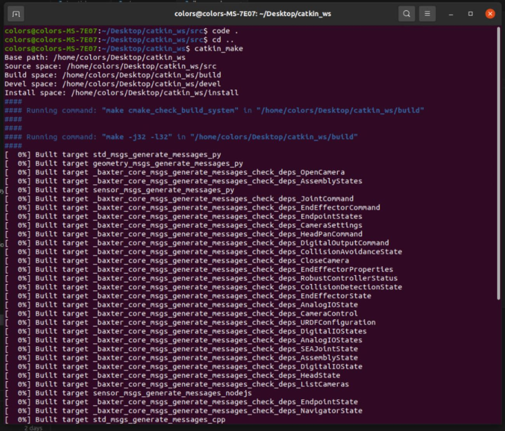
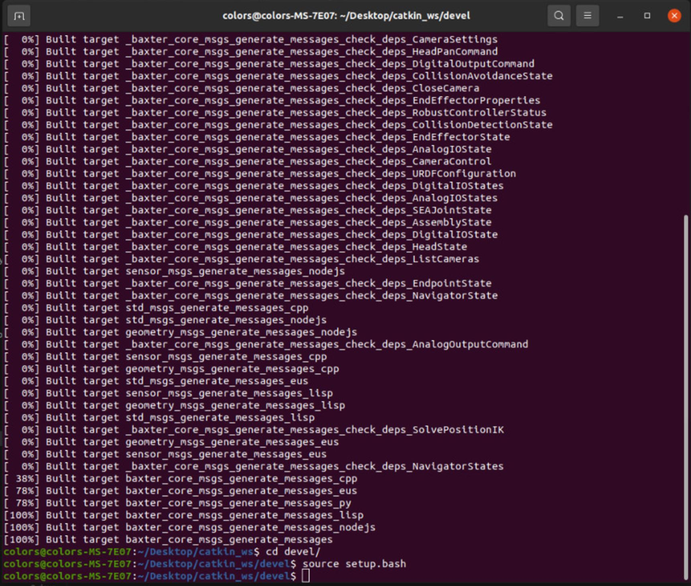

# BAXTER TUTORIAL

## Connecting

1) Power On and Robot Enable Code:
To power on Baxter, press the button located on the back left side, as shown in Figure 1.



After powering on, you can open the terminal using the ```ctrl+alt+f1``` shortcut. When the login screen appears, use the username: ```ruser``` and password (ask someone in the lab for it) to log in. 
You can perform this action either by connecting a keyboard to Baxter's computer or by connecting via SSH from another computer ssh ```ruser@79.123.176.47``` , as shown in Figure 2. Use ```ctrl+alt+f3``` shortcut on the robot to get the ip address.
_To connect via SSH, make sure you are on the same network as Baxter_. 
You can connect to the CMPE network using the blue Ethernet cables with the setup shown in Figure 2. 



## Running Code:

> Please check no objects (like tables, chairs,...) are too close to the robot and it's arms when you make it move, and always keep the red emergency stop button close to you to deactivate the robot if it's about to impact something!   

### On Baxter computer
Before running any code, it is necessary to source the baxter.sh and run the enable_robot code ```source ~/ros_ws/devel/setup.sh``` ```conda activate ros_env``` . 
If you forget to run the enable_robot code, the robot will not move even if the code appears to be running.
On Baxter's computer, you will find various codes for users' convenience, such as baxter_interface or baxter_examples (https://github.com/RethinkRobotics/baxter_interface).



To run the example codes on Baxter's internal computer: Default codes are also available if you navigate to the baxter_examples directory. For the exact location, refer to Figure 4. Here, you can execute your desired code using either ```./file_name.py``` or ```python file_name.py``` commands. It's important to note that these codes are written in Python 2.7, and Baxter's computer uses Python 2.7 as well. That's why if you wanna code with Python3 you should use this baxter-python3 repository and include it in your projext. 
You can send your python files along with the baxter-pyhton3 interface to Baxter computer using ssh or scp. Remember that Baxter computer has limited computational ability, so if your projext it's complex you should run the code in your computer and pass only the commands to Baxter.



### On your computer
To run code from another computer on the same network, and sent to Baxter ROS node only the commands, you should set YOUR computer's variable ROS_MASTER_URI to Baxter. You can automate this by setting ROS_MASTER_URI and ROS_IP to your computer's ~/.bashrc, as shown in Figure 5. The ROS_MASTER_URI should be "http://baxter_ip:11311," where Baxter's IP address is static and doesn't need to be changed once added. Your computer's ROS_IP should be your computer's IP address on the CMPE network. Since this IP address can change when you restart your computer, it's a good practice to verify it each time you start your computer. You can find your computer's IP address using the "ifconfig" command in the terminal. The IP addresses of computers on the CMPE network typically follow the format 79.123.176.XX. If you can see the topics when you run the rostopic list command but can't see them when you run rostopic echo /topic_name, the issue may be related to not updating your computer's IP address. For more information, refer to http://wiki.ros.org/ROS/Tutorials/MultipleMachines.



After completing this step, you should be able to view Baxter's topics using the ```rostopic list``` command.



You cannot use "baxter_interface" folder with Python 3 on your computer. However, you can find most of the methods in the baxter.py code.



To run code on your computer and use the baxter.py code, you should add the baxter_core_msgs from https://github.com/RethinkRobotics/baxter_common to your ROS workspace (learn how to create a ROS workspace here: http://wiki.ros.org/catkin/Tutorials/create_a_workspace) and then run catkin_make. 
You can verify that this repository is compiled from Figure 8.



After this process, you can use the setup.bash from the devel directory.



Please note that the provided instructions assume basic familiarity with the ROS (Robot Operating System) environment and its concepts.


## Shortcuts
```
ctrl+alt+f1 : open terminal 
ctrl+alt+f3 : open ip address details (to see the robot ip)
ctrl+alt+f4 : normal view
```