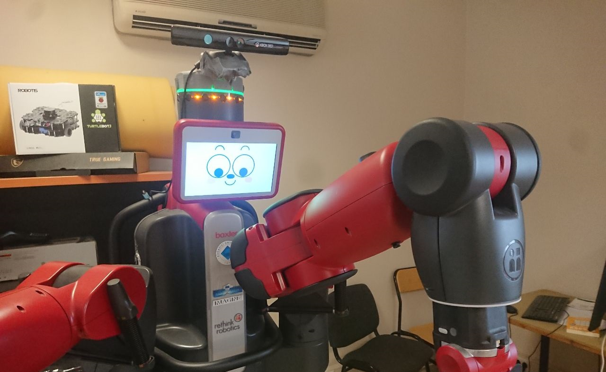

# Baxter Python 3
**Code Baxter with Python3!**
## Description 
Useful port of baxter interface to control your Baxter with Python 3.
If you need an introductive tutorial on baxter checkout [this Baxter introduction](https://igor-lirussi.github.io/baxter-python3/BAXTER_TUTORIAL)


### Topics:
- Baxter Robot 
- Human Robot Interaction
- Python 3

## Result


## Requirements & Dependencies
everything should be already installed if you are running in the robot, for running it on your pc you need: 
- Python 3
- rospy
- opencv

## Install in your repository
*   add this repo in your repo: ```git submodule add git@github.com:igor-lirussi/baxter-python3.git```
*   if you want to check for updates of the submodule: ```git submodule update --remote```

*	remember to tell users to clone your repo with --recurse-submodules: ```git clone --recurse-submodules https://github.com/your_name/your_repo```
*  	if a user clones without --recurse-submodules will find the empty folder, download the submodules with ```git submodule init``` and ```git submodule update```


## Run
```
import importlib
baxter=importlib.import_module("baxter-python3.baxter")

import rospy
rospy.init_node("example")
rospy.sleep(2.0)
robot = baxter.BaxterRobot(arm="left")
rospy.sleep(2.0)
robot.set_robot_state(True)
robot.move_to_neutral()
robot.move_to_zero()
robot.move_to_joint_position({"left_s0": 1.0})
robot.move_to_joint_position({"left_s0": -1.0})
robot.move_to_neutral()
robot.set_robot_state(False)
```

check the examples for more.

## Useful Resources & Extra
### Face expressions
This code repo, if imported in your project, allows you to give different facial expression to Baxter robot. 

Useful to warn the people around of the movements that are about to happen, looking at the place before moving the joints. 
```

import importlib
importlib.import_module("baxter-python3.faces")

#set looking direction
_set_look(robot, "down")

#or display a face
_set_face(robot, "left_down")
```



- Links
- Resources

## Authors
* **Igor Lirussi** @ BOUN Boğaziçi University - CoLoRs (Cognitive Learning and Robotics) Lab
* **Alper Ahmetoglu** @ BOUN Boğaziçi University - CoLoRs (Cognitive Learning and Robotics) Lab
* **Deniz Bilge Akkoç** @ BOUN Boğaziçi University - CoLoRs (Cognitive Learning and Robotics) Lab

## Acknowledgments
*   All the people that contributed with suggestions and tips.

## License
This project is licensed - see the [LICENSE](LICENSE) file for details.
